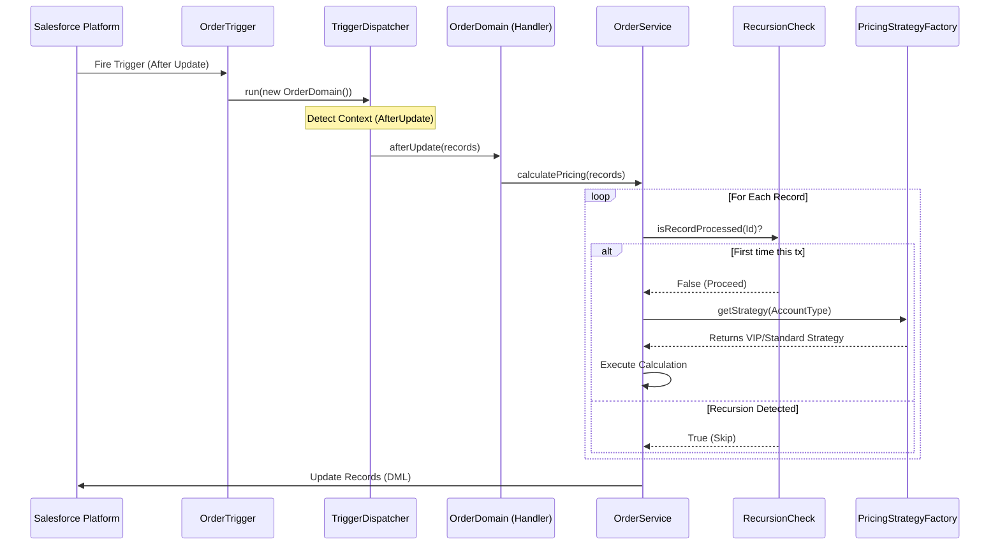

# Salesforce Enterprise Order Management Architecture

[](https://developer.salesforce.com/)
[](https://opensource.org/licenses/MIT)


## 📖 Overview
This repository is a reference implementation of an enterprise-grade Order Management architecture on Salesforce. It goes beyond simple triggers to adopt a layered MVCS (Model, View, Controller, Service) approach with domain logic, patterns, testability, and loose coupling.

The solution simulates a high-volume Order Processing Engine that performs validation, recursion control, message-based updates, and dynamic pricing via Strategy/Factory patterns. It includes LWC for UI, Platform Events for decoupling, PMD for static code analysis, and Jest for LWC tests.

### 🎯 Goals
- Separation of Concerns (Triggers → Domain → Services → Patterns)
- Implement GoF Design Patterns (Strategy, Factory) in Apex
- Adhere to SOLID principles (Open/Closed, Interface Segregation)
- Enterprise safeguards (recursion guards, error handling, logging)
- CI-friendly quality gates (PMD), unit tests, and message-driven design

---

## 🏗 Architecture

### Execution Flow
A Trigger Framework routes platform events and DML contexts to a domain handler, which orchestrates the service layer. Pricing is resolved at runtime using the Strategy pattern.



### Layer Breakdown

| Layer | Class | Responsibility |
| :--- | :--- | :--- |
| Interface | `framework/ITriggerHandler.cls` | Contract for domain handlers |
| Dispatcher | `framework/TriggerDispatcher.cls` | Maps trigger contexts to methods |
| Base Handler | `framework/TriggerHandler.cls` | Virtual base; override only what you need |
| Domain | `domain/OrderDomain.cls` | Validation, orchestration, delegates to service |
| Service | `service/OrderService.cls` | Business logic, DML orchestration |
| Strategy Interface | `patterns/IPricingStrategy.cls` | Strategy contract |
| Strategy Impl | `patterns/VipPriceStrategy.cls`, `patterns/StandardPriceStrategy.cls` | Concrete algorithms |
| Factory | `patterns/PricingStrategyFactory.cls` | Resolves strategy by context |
| Utilities | `utils/Logger.cls`, `utils/RecursionCheck.cls` | Error handling, recursion guard |
| Selector | `OrderSelector.cls` | Query isolation (selector layer) |
| Controller | `OrderController.cls` | API/UI-facing controller/stub |
| Messaging | `messageChannels/OrderMessageChannel.messageChannel-meta.xml` | LMS channel for LWC |
| Events | `objects/Order_Notification__e/*` | Platform Event for decoupling |
| LWC | `lwc/orderList/*` | Example UI list, Jest tests |

---

## 📂 Project Structure

```bash
force-app/main/default/
├── classes/
│   ├── framework/
│   │   ├── ITriggerHandler.cls
│   │   ├── TriggerHandler.cls
│   │   └── TriggerDispatcher.cls
│   ├── domain/
│   │   └── OrderDomain.cls
│   ├── service/
│   │   └── OrderService.cls
│   ├── patterns/
│   │   ├── IPricingStrategy.cls
│   │   ├── PricingStrategyFactory.cls
│   │   ├── VipPriceStrategy.cls
│   │   └── StandardPriceStrategy.cls
│   ├── utils/
│   │   ├── Logger.cls
│   │   └── RecursionCheck.cls
│   ├── OrderController.cls
│   ├── OrderSelector.cls
│   ├── IOrderService.cls
│   ├── IOrderSelector.cls
│   ├── CustomException.cls
│   ├── Application.cls
│   └── tests/
│       └── OrderControllerTest.cls
├── lwc/
│   └── orderList/
│       ├── orderList.html
│       ├── orderList.js
│       ├── orderList.js-meta.xml
│       └── __tests__/orderList.test.js
├── messageChannels/
│   └── OrderMessageChannel.messageChannel-meta.xml
├── objects/
│   └── Order_Notification__e/
│       ├── Order_Notification__e.object-meta.xml
│       └── fields/
│           ├── Order_Id__c.field-meta.xml
│           └── Type__c.field-meta.xml
├── triggers/
│   └── OrderTrigger.trigger
└── scripts/
    ├── apex/hello.apex
    └── soql/account.soql
```

---

## 🧩 Key Design Decisions

1) Lean Trigger Framework (Virtual Base Class)
- Domain handlers extend `TriggerHandler` and override only relevant contexts (e.g., `afterUpdate`). Reduces noise and adheres to Interface Segregation.

2) Strategy + Factory for Pricing
- `IPricingStrategy` defines the contract; `VipPriceStrategy` and `StandardPriceStrategy` implement algorithms.
- `PricingStrategyFactory` selects the strategy based on input context (e.g., Account/Order type).
- Open/Closed Principle: add a new strategy (e.g., BlackFridayPriceStrategy) without modifying service code.

3) Recursion Guard
- `RecursionCheck` uses static state to ensure a record is processed once per transaction, preventing loops from trigger → DML → trigger.

4) Security Model
- `with sharing` for business logic where record access must be respected.
- `inherited sharing` for utilities/factories/dispatchers to run in caller’s context (LWC vs. Batch).

5) Error Handling and Logging
- `Logger.cls` centralizes logging, making it simpler to add structured logs and future observability integrations.

6) Selector and Controller Layers
- `OrderSelector` isolates SOQL, helping testing and reuse.
- `OrderController` provides a façade for UI/API; the test `OrderControllerTest.cls` demonstrates unit test structure.

---

## 🖥 LWC Overview

- `orderList` demonstrates basic UI interaction and wiring.
- Uses Lightning Message Service with `OrderMessageChannel` for decoupled UI updates.
- Tested with Jest (`__tests__/orderList.test.js`).

Run LWC tests locally:
```bash
npm install
npm run test:unit
```

---

## 🔧 Tooling and Quality

- PMD Static Analysis: GitHub Action `.github/workflows/pmd-analysis.yml` enforces rules from `pmd-ruleset.xml`.
- Prettier/ESLint: Code style enforced via `.prettierrc`, `.prettierignore`, and `eslint.config.js`.
- Jest: LWC unit tests ready via `jest.config.js`.

Run PMD locally (via npm script if configured) or rely on CI workflow.

---

## 🚀 Setup and Deployment

Prerequisites
- Node.js 18+
- Salesforce CLI (sf)
- VS Code with Salesforce extensions

Clone
```bash
git clone https://github.com/k4zludk3/sfdc-enterprise-om.git
cd sfdc-enterprise-om
```

Authorize an org
```bash
sf org login web --alias my-org
sf org display --target-org my-org
```

Deploy metadata
```bash
# Deploy everything in force-app; include tests if preferred
sf project deploy start --target-org my-org --source-dir force-app
```

Run Apex tests (examples)
```bash
# Run all local tests
sf apex run test --target-org my-org --test-level RunLocalTests

# Run specific tests
sf apex run test --target-org my-org --tests OrderControllerTest
```

Retrieve (optional)
```bash
sf project retrieve start --target-org my-org --source-dir force-app
```

Scratch org (optional)
```bash
sf org create scratch --definition-file config/project-scratch-def.json --alias om-scratch --duration-days 7 --set-default
sf project deploy start --target-org om-scratch --source-dir force-app
```

Note: This project follows modern `sf` CLI commands.

---

## ✅ Quick Verification (Anonymous Apex)

Use Developer Console → Execute Anonymous:

```apex
// Create a synthetic Order (replace AccountId with a valid Id)
Order vipOrder = new Order(
    AccountId = '001XXXXXXXXXXXXXXX',
    Status = 'Draft',
    EffectiveDate = Date.today(),
    Type = 'VIP' // triggers VipPricingStrategy
);
insert vipOrder;

vipOrder.Status = 'Activated';
update vipOrder;

Order res = [SELECT Description FROM Order WHERE Id = :vipOrder.Id];
System.debug(res.Description);
// Expected: "Final Price: 85.00" (15% discount applied)
```

---

## 🧪 Testing Matrix

- Apex Unit Tests: `OrderControllerTest.cls` (extend with service, domain, and strategy tests)
- LWC Unit Tests: `orderList/__tests__/orderList.test.js`
- Static Analysis: PMD via GitHub Actions
- Optional: Add Apex PMD/Code Analyzer to pre-commit pipeline

---

## 🗺 Extensibility Guide

Add a new pricing strategy:
1) Create `BlackFridayPriceStrategy.cls` implementing `IPricingStrategy`.
2) Register logic in `PricingStrategyFactory` (switch/if by context or metadata).
3) Add unit tests for the new strategy.
4) Deploy and validate via existing service flows.

Introduce a new domain behavior:
1) Extend `TriggerHandler` and override only needed methods.
2) Route via `TriggerDispatcher` from the trigger.
3) Keep DML and logic in service classes for reusability.

---

## 🧰 Scripts

- `scripts/apex/hello.apex`: Sample anonymous apex script.
- `scripts/soql/account.soql`: Sample SOQL query.

Run a script:
```bash
sf apex run --target-org my-org --file scripts/apex/hello.apex
```

---

## 🔐 Security Considerations

- Enforce FLS and CRUD checks in service/controller as needed for your org.
- Respect sharing with `with sharing` or `inherited sharing` per class role.
- Avoid exposing internal exceptions; use `CustomException` and `Logger`.

---

## 🤝 Contributing

1) Fork the repo
2) Create a feature branch
3) Commit with conventional messages
4) Open a PR describing architecture impact and tests

---

## 👤 Author

Lucas Duque
- Senior Salesforce Developer
- Focus: Scalable Apex, LWC, Enterprise Patterns
- LinkedIn: https://www.linkedin.com/in/lucasduque97/

---

## 📄 License

MIT License. See LICENSE file if present or the badge link above.
